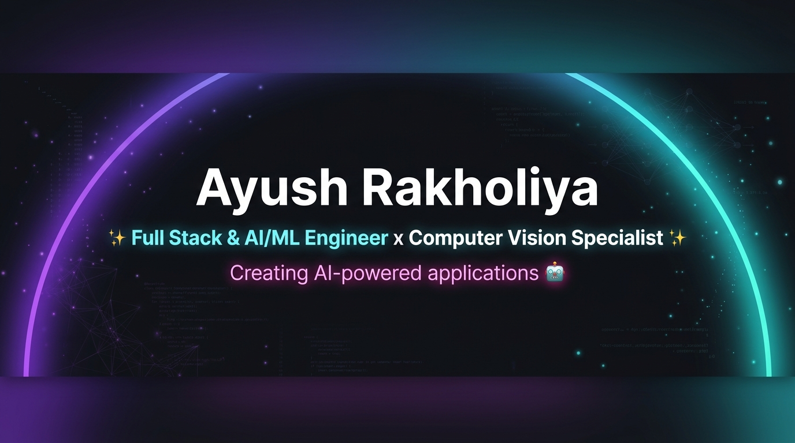

  

  
  
  
  

## About Me
Hi! I'm Ayush Rakholiya, a **Full-Stack & AI/ML Engineer** at **Yudiz Solutions Limited**. I have 2+ years of experience developing and maintaining end-to-end web applications, real-time Computer Vision pipelines, and LLM-powered systems. I specialize in building scalable backend services with **Python (Django, FastAPI, Flask)**, interactive frontends with **React.js**, real-time vision processing (**YOLOv8, OpenCV**), and cloud microservices on **AWS & Docker**.

- 🔭 &nbsp; **Building:** Real-time Computer Vision (RTSP video streams) & Enterprise Full-Stack Web Applications (ERP, E-Commerce, Telemedicine).
- 🤖 &nbsp; **Architecting:** LLM applications, empathetic mental health chatbots, LangChain workflows, AI safety guardrails & ML models (PyTorch, Scikit-Learn).
- ⚡ &nbsp; **Backend Engineering:** Low-latency RESTful APIs (Django REST Framework, FastAPI, Flask), async task processing (Celery, Redis) & microservices.
- 💻 &nbsp; **Frontend & UI:** Interactive React.js interfaces, reusable UI component libraries, state management & REST API integrations.
- ☁️ &nbsp; **Cloud & DevOps:** AWS infrastructure (EC2, S3, Lambda, API Gateway), Docker containerization, Linux environments & Git workflows.
- 💬 &nbsp; **Talk to me about:** Python, AI/ML, Computer Vision, React.js, Django, FastAPI, PostgreSQL, AWS & Docker.
- 🎯 &nbsp; **Goal:** Developing scalable, production-grade AI systems and clean, maintainable full-stack software architectures.

---

## Technology Arsenal

### Core Programming Languages

### AI, Machine Learning & Computer Vision

### Generative AI & LLMs

### Backend Engineering & Frameworks

### Frontend Technologies

### Databases & Data Modeling

### Cloud Infrastructure & DevOps

### Automation & Tools

---

## What I Build
- ✅ &nbsp; **Real-Time Computer Vision & Stream Processing:** Handling live RTSP camera feeds for human detection, counting, employee face recognition, and occupancy monitoring (YOLOv8, OpenCV, DeepFace).
- ✅ &nbsp; **Full-Stack Application Development:** Building end-to-end web applications with React.js interfaces connected to Python backends (Django, Django REST Framework, FastAPI, Flask).
- ✅ &nbsp; **LLM Applications & Conversational Agents:** Developing empathetic chatbots with prompt engineering, conversation memory, contextual responses, and AI safety guardrails (LangChain).
- ✅ &nbsp; **Async Task Queues & Scheduled Workflows:** Implementing background task processing, automated notifications, and PDF/Excel exports using Celery and Redis.
- ✅ &nbsp; **Deep Learning Signal Processing:** Building audio feature extraction pipelines (MFCC) for real-time infant cry classification and inference services.
- ✅ &nbsp; **API Security & Database Optimization:** Designing REST APIs with role-based access control (RBAC), JWT authentication, Swagger documentation, and optimized PostgreSQL/MySQL queries.
- ✅ &nbsp; **Cloud & Microservices Deployment:** Containerizing multi-tier applications using Docker and deploying cloud services on AWS (EC2, S3, Lambda, API Gateway).

---

## Yudiz Solutions Limited Spotlight

**Full Stack & AI/ML Engineer** • *Ahmedabad, India*  
*Tech Stack:* `Python` • `FastAPI` • `Django` • `React.js` • `OpenCV` • `YOLOv8` • `PostgreSQL` • `Docker` • `AWS` • `Redis` • `Celery`

### 📝 Career Abstract & Core Capabilities
- **Full-Stack Development:** 2+ years of experience developing and maintaining end-to-end web applications using Python (Django, FastAPI, Flask) and React.js (JavaScript ES6+, HTML5, CSS3), focusing on clean, modular, and maintainable code.
- **Frontend & React.js Development:** Hands-on experience building responsive web interfaces using React components, Hooks, state management, routing, forms, API integration, and reusable layouts.
- **Backend Development & API Integration:** Strong expertise in developing backend business logic, authentication systems, and RESTful APIs using Django REST Framework, FastAPI, and Flask with Swagger/OpenAPI documentation.
- **Database & Data Modeling:** Working experience with PostgreSQL, MySQL, SQLite, DynamoDB, and MongoDB, including schema design, complex queries, migrations, and ORM integrations.
- **Cloud, Deployment & DevOps:** Practical deployment experience on AWS (EC2, S3, Lambda, API Gateway), Linux environments, Git/Bitbucket workflows, and containerization using Docker.
- **Security & Code Quality:** Deep understanding of RBAC, input validation, API security practices, unit/integration testing, debugging, and performance optimization.
- **Additional Integration Experience:** Background task execution (Celery/Redis), web scraping, third-party API integrations (Twilio, SMTP), Dialogflow, and OpenCV stream analytics.

---

## Featured Projects

### 1. [Human Recognition & Occupancy Monitoring System]([Project Link 1])
> **Tech Stack:** `YOLOv8` `OpenCV` `FastAPI` `PostgreSQL` `Python` `RTSP`
- Built a real-time CCTV-based Human Recognition and Occupancy Monitoring System using YOLOv8 and OpenCV.
- Implemented real-time employee face recognition and live identity overlays on camera streams.
- Engineered FastAPI backend services to monitor cabin-wise presence, process live RTSP feeds, and count human occupancy.

### 2. [AI Mental Health Chatbot]([Project Link 2])
> **Tech Stack:** `LangChain` `LLMs` `Python` `Prompt Engineering` `AI Safety`
- Developed an LLM-powered mental health chatbot for empathetic, context-aware user conversations.
- Implemented conversation memory, custom prompt engineering, and contextual response pipelines.
- Integrated strict AI safety guardrails to ensure response quality, empathy, and conversational reliability.

### 3. [NeuroCry-AI: Infant Cry Analysis]([Project Link 3])
> **Tech Stack:** `PyTorch` `MFCC` `FastAPI` `Deep Learning` `Audio Processing`
- Built a deep learning classification system to identify infant cry patterns.
- Engineered an MFCC-based (Mel-Frequency Cepstral Coefficients) audio feature extraction pipeline.
- Served real-time predictions via low-latency FastAPI REST API inference endpoints.

#### 4. [AI Job Application Automation]([Project Link 4])
> **Tech Stack:** `n8n` `SMTP` `Email APIs` `Automation`
- Created an automated workflow with n8n to streamline job search and application submissions.
- Integrated SMTP and Email APIs for automated resume delivery and recruiter outreach.
- Implemented automated scheduling, retry mechanisms for failed requests, and workflow execution monitoring.

---

## Professional Experience

### **Yudiz Solutions**
**Full Stack & AI/ML Engineer**  
`Python` • `FastAPI` • `Django` • `React.js` • `OpenCV` • `YOLOv8` • `PostgreSQL` • `Docker` • `AWS`

- Developing real-time Computer Vision applications using Python, OpenCV, and YOLOv8 to process live RTSP camera feeds for human detection, counting, and employee recognition.
- Building FastAPI and Django REST Framework backend services for low-latency AI inference, business logic, and authentication.
- Developing interactive React.js frontend dashboards integrated with backend APIs for enterprise web platforms.
- Containerizing AI and web applications using Docker and managing PostgreSQL databases for scalable cloud deployment.

---

## Education & Certifications

### Education
- **Bachelor of Technology in Computer Engineering** — *Silver Oak University* (2023 – 2025)
- **Diploma in Computer Engineering** — *Prime Institute of Engineering (GTU)* (2019 – 2022)

### Certifications
- 📜 **Generative AI & LLM Applications** — Calyza Tech
- 📜 **AI & Machine Learning Fundamentals** — Udemy (Andrei Neagoie)

---

## GitHub Analytics & Activity

  
  

  

---

## Connect With Me

  
  
  

